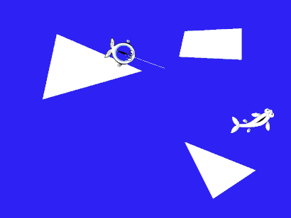

# Description

This program shows the pathfinding algorithm written for the game Fishnapped (https://github.com/zxdan523/game_design). The algorithm was not used in the final version of the game due to a change in gameplay direction.

# Build Instructions

## Mac
```bash
brew install cmake
brew install sfml
```
## Linux
```bash
sudo apt-get install cmake
sudo apt-get install libsfml-dev
```
To run on Mac/Linux:

```bash
./build.sh
cd build
./TestPath
./FISHNAPPED
```
Note: TestPath runs the algorithm example. FISHNAPPED runs the original game. Also make sure you cd into the folder and not use: ./build/TestPath

# Examples

Pathfinding Example:



Original Game:


